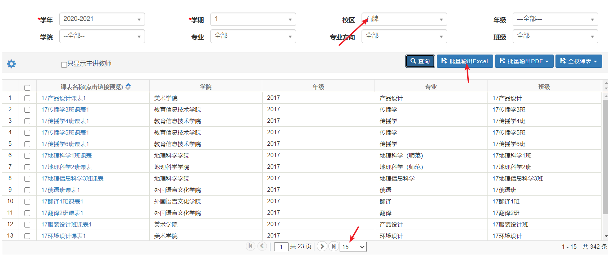
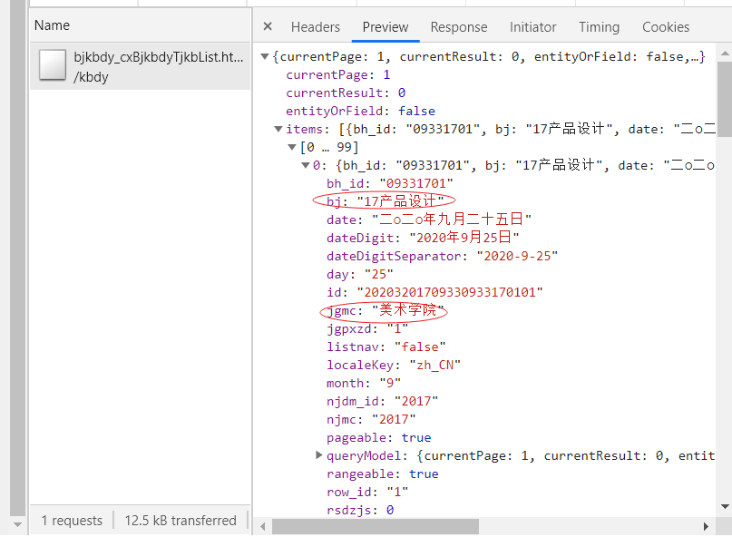

# scnu-courses-xls-parser
Parse SCNU xls format course schedule

> 以推荐课表批量导出的xls为数据来源做的挣扎。因为大量公共必修课(英语，思政课之类的)在推荐课表导出的只有“板块”二字，没有上课地点时间等信息就此作罢，但是还是记录一下思路吧。。。。





```js
a=temp1.reduce((acc,cur) => {acc[cur['tjkbmc']]=cur['jgmc']; return acc;}, {})
JSON.stringify(a,null,2)
```
获得班级到学院的json数据-> `json-data/class2department.json`

将excel文件放在`excel-data`目录下然后运行
```
node index.js
```
输出parse后的数据，可以用`DEBUG`环境变量查看log输出。详见[debug 文档](https://www.npmjs.com/package/debug)

因为用了`fs.promise` Node 版本至少要10.x